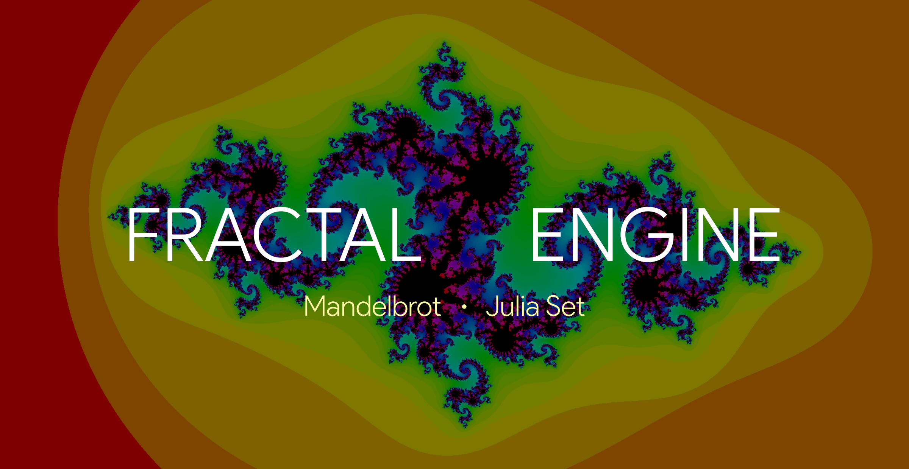
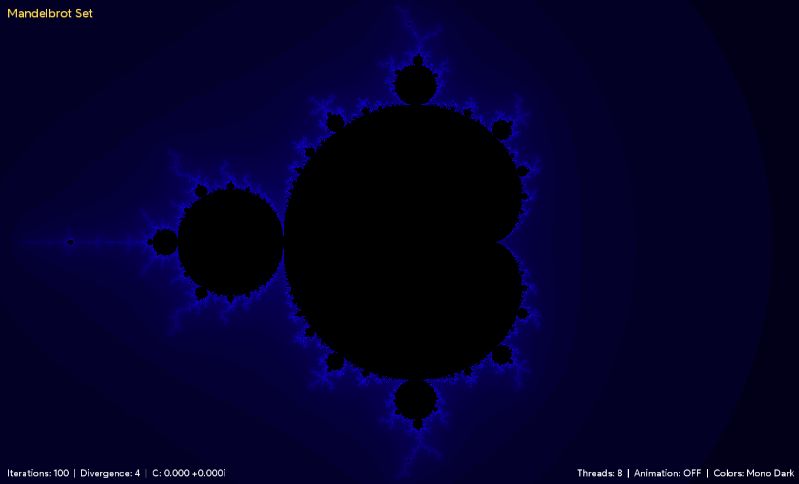
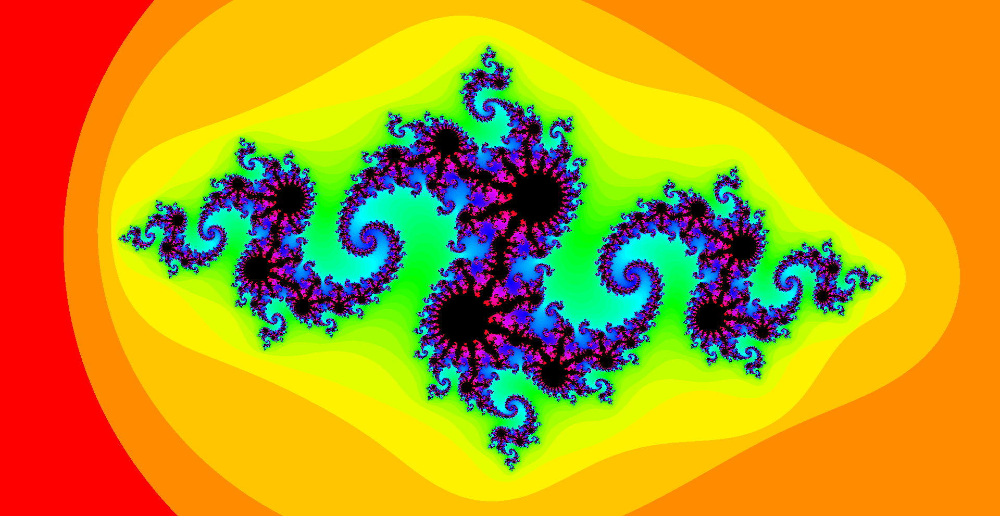
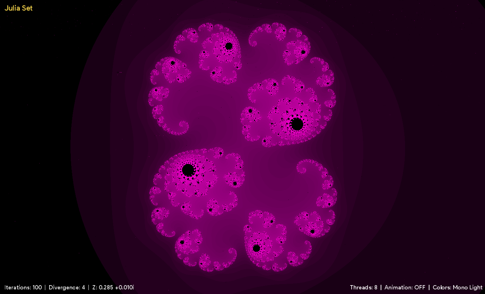
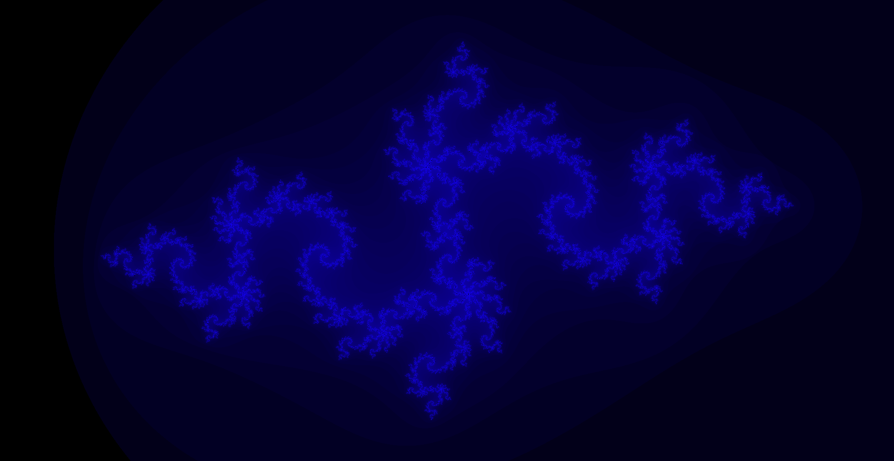
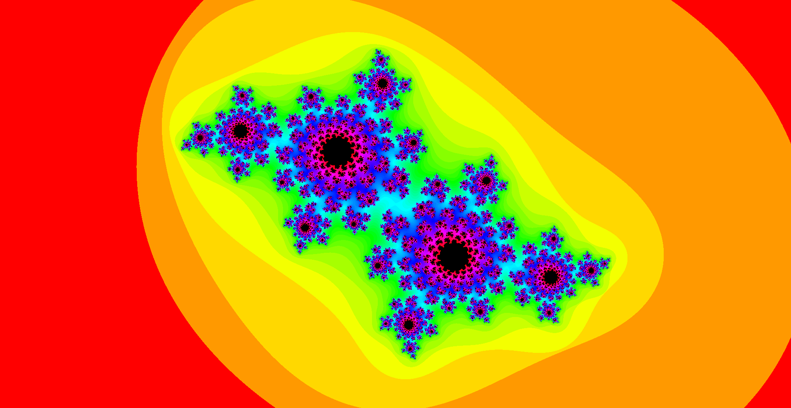
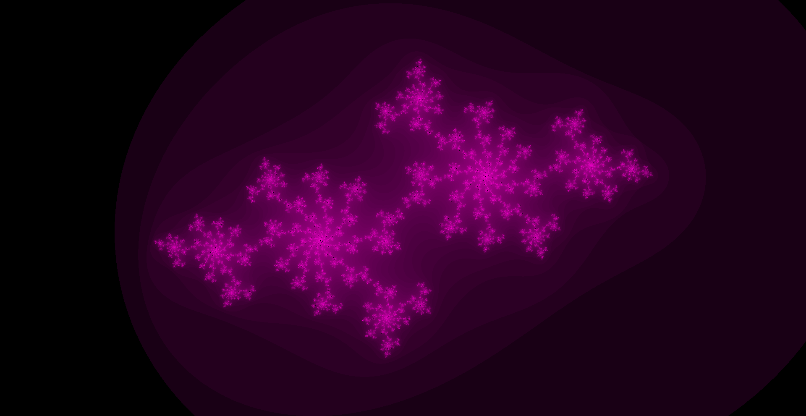

# Fractal Rendering Engine

#### This is an interactive fractal simulation and rendering engine for the visualization of Mandelbrot and Julia Sets

#### [View Demo on YouTube](https://youtu.be/HMKS5evDOoE)

###### See also
[Times Table Simulation](https://github.com/ChauhanRohan-RC/Times-Table)  
[Fourier Series Simulation](https://github.com/ChauhanRohan-RC/Fourier-Series)  
[3D N*N Rubik's Cube solver-AI](https://github.com/ChauhanRohan-RC/Cube.git)

## Overview
* Fractal is an infinitely complex geometric shape consisting of patterns that repeat forever. Every part of a fractal, no matter how zoomed in or zoomed out resembles the statistical features of the whole image.
* This engine has both **Graphical User Interface (GUI)** and **Command LIne Interface (CLI)**. Available fractals are
* [The Mandelbrot set](https://en.wikipedia.org/wiki/Mandelbrot_set): 
  * `Generating function`: $f_c(z) = z^2 + c$, where z and c are complex numbers, c is the parameter.
  * `Definition`: It is a set of all complex numbers $c$ for which the generating function $f_c(z) = z^2 + c$ **does not diverge** on repeated iterations, starting with a fixed value of $z$.
  * `Seed`: $z_0$ i.e. the starting value of $z$.
  * `Fractal Type`: Parameter space ($c$ vs convergence rate).

* [The Julia set](https://en.wikipedia.org/wiki/Julia_set):
  * `Generating function`: $f_c(z) = z^2 + c$, where z and c are complex numbers, c is the parameter.
  * `Definition`: It is a set of all complex numbers $z$ for which the generating function $f_c(z) = z^2 + c$ **does not diverge** on repeated iterations, starting with a fixed value of $c$.
  * `Seed`: $c$ i.e. the fixed parameter.
  * `Fractal Type`: Domain space ($z$ vs convergence rate).

## Usage
* Install [Java](https://www.oracle.com/in/java/technologies/downloads/) on your computer and add it to the path
* Clone this repository  
  `git clone https://github.com/ChauhanRohan-RC/Fractal.git`
* Navigate to `out\artifacts\Fractal_jar` and run `launch.bat`.  
  Optionally, open up the terminal and run `java -jar Fractal.jar`

## Algorithm Parameters
* `Seed`: starting value for the fractal to build upon.
* `Divergence Distance`: Maximum distance threshold allowed for the fractal, after which it is flagged as diverging.
* `Max iterations`: Maximum number of times the generating function is iterated to calculate the overall convergence rate.
* `Workers`: Number of threads to generate the fractal in parallel.

## Controls
### Fractal Controls
* `F` : Change the Fractal. Available fractals are
  * `Mandelbrot Set`: default seed $z_0 = 0 + 0i$ 
  * `Julia Set`: default seed $c = 0 + 0i$
* `S` : Change the seed control mode
  * `Fixed`: seed does not change over time
  * `Animate Periodic`: seed oscillates periodically (like a sine wave) with time
  * `Mouse Control`: seed value is controlled by the current mouse position in real time.
* `R` : Reset seed to default value
* `+/-` : Change maximum number of iterations
* `Ctrl +/-` : Change the divergence distance
* `Shift +/-` : Change the number of worker threads

### Transforms
* `Up/Down/Left/Right` : Translate the fractal
* `Ctrl-Up` : Zoom-in the fractal
* `Ctrl-Down` : Zoom-out the fractal
* `Shift-R` : Reset View

### Graphics
* `C` : Change color mapping scheme [Light | Dark | Hue]
  * `Mono Light`: Light-Monochromatic color mapping
  * `Mono Dark`: Dark-Monochromatic color mapping
  * `Hue`: Hue cycle mapping in HSB color space
* `H` : Toggle HUD (Overlay text)
* `Ctrl-S` : Save the current frame (capture screenshot)
* `Ctrl-R` : Reset Everything

## Commands
* `seed <complex number>` : Set the current fractal seed. Example: seed -0.8 + 0.156i
* `change fractal` : switch to next fractal [Mandelbrot Set | Julia Set]
* `change color` : change color mapping [Light | Dark | Hue]
* `change sc` : change seed control mode [Fixed | Periodic | Mouse]
* `toggle hud` : toggle HUD
* `save` : save current frame
* `reset <scope>` : Reset the given scope [view | seed | all]. Example: reset seed
* `exit` : Kill the engine

## Connect on
[Twitter](https://twitter.com/0rc_studio)  
[Youtube](https://www.youtube.com/channel/UCmyvutGWtyBRva_jrZfyORA)  
[Google Play Store](https://play.google.com/store/apps/dev?id=7315303590538030232)  
E-mail: com.production.rc@gmail.com

